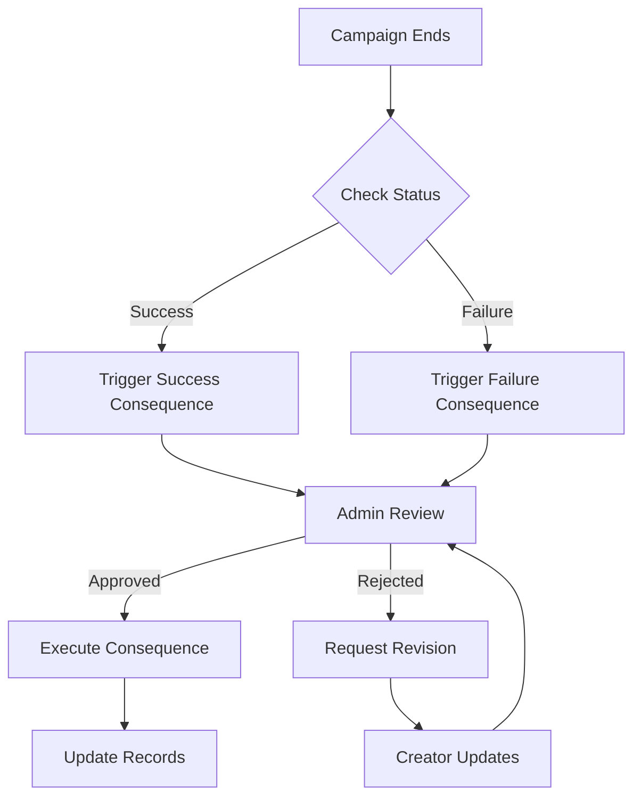

# Consequence Handling Documentation

## Overview

The consequence system ensures accountability in campaigns by managing and executing predefined outcomes based on campaign success or failure.

## Consequence Types

### Success Consequences

1. **Reward**
   - Distributes rewards to backers
   - Validates reward fulfillment
   - Tracks delivery status

2. **Stretch**
   - Unlocks additional goals
   - Adjusts funding targets
   - Updates campaign milestones

3. **Community**
   - Implements community-decided actions
   - Manages voting process
   - Executes chosen outcomes

### Failure Consequences

1. **Refund**
   - Calculates refund amounts
   - Processes partial refunds
   - Updates pledge statuses

2. **Charity**
   - Validates charity eligibility
   - Transfers funds
   - Issues tax receipts

3. **Challenge**
   - Tracks challenge completion
   - Verifies evidence
   - Updates campaign status

## Workflow



## Implementation Details

### Consequence Request

```typescript
interface ConsequenceRequest {
  campaign_id: string;
  type: 'success' | 'failure';
  notes?: string;
}

async function requestConsequenceTrigger(request: ConsequenceRequest) {
  // Validate request
  // Create request record
  // Notify admin
  // Return request status
}
```

### Consequence Execution

```typescript
interface ConsequenceExecution {
  request_id: string;
  approved_by: string;
  execution_details: {
    type: string;
    actions: string[];
    status: string;
  };
}

async function executeConsequence(execution: ConsequenceExecution) {
  // Verify approval
  // Execute actions
  // Update records
  // Notify stakeholders
}
```

### Status Tracking

```typescript
interface ConsequenceStatus {
  status: 'pending' | 'approved' | 'rejected' | 'executed';
  last_updated: string;
  notes?: string;
}

async function getConsequenceStatus(campaign_id: string): Promise<ConsequenceStatus> {
  // Fetch current status
  // Return status details
}
```

## Database Schema

```sql
-- Consequence requests
CREATE TABLE consequence_requests (
  id UUID PRIMARY KEY,
  campaign_id UUID REFERENCES campaigns(id),
  type TEXT NOT NULL,
  status TEXT NOT NULL,
  notes TEXT,
  created_at TIMESTAMPTZ DEFAULT NOW(),
  updated_at TIMESTAMPTZ DEFAULT NOW()
);

-- Consequence executions
CREATE TABLE consequence_executions (
  id UUID PRIMARY KEY,
  request_id UUID REFERENCES consequence_requests(id),
  executed_by UUID REFERENCES profiles(id),
  execution_details JSONB,
  executed_at TIMESTAMPTZ DEFAULT NOW()
);
```

## Security Measures

1. **Admin Approval Required**
   - All consequence triggers require admin review
   - Multi-step verification process
   - Audit trail of approvals

2. **Automated Validation**
   - Checks for required conditions
   - Validates fund availability
   - Verifies stakeholder eligibility

3. **Error Handling**
   - Rollback mechanisms
   - Failure notifications
   - Recovery procedures

## Admin Interface

```typescript
interface AdminConsequenceReview {
  request_id: string;
  campaign_details: CampaignSummary;
  consequence_type: string;
  proposed_actions: string[];
  verification_checklist: string[];
}

async function reviewConsequence(review: AdminConsequenceReview) {
  // Review request details
  // Verify conditions
  // Approve or reject
  // Log decision
}
```

## Notifications

```typescript
interface ConsequenceNotification {
  type: 'request' | 'approval' | 'rejection' | 'execution';
  recipient_id: string;
  campaign_id: string;
  details: object;
}

async function sendConsequenceNotification(notification: ConsequenceNotification) {
  // Format notification
  // Send to recipient
  // Log delivery
}
```

## Error Recovery

```typescript
interface ConsequenceError {
  request_id: string;
  error_type: string;
  details: object;
  recovery_steps: string[];
}

async function handleConsequenceError(error: ConsequenceError) {
  // Log error
  // Attempt recovery
  // Notify stakeholders
  // Update status
}
```